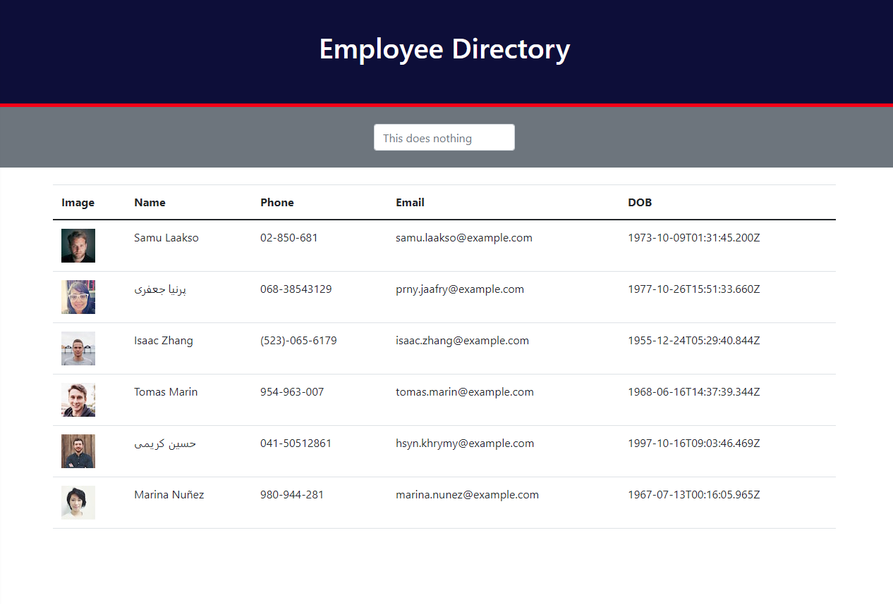

# react-employee-directory
*Working on making a Front End directory with axios, Node.js and React.*

[View Deployed Application Here.](https://pythonidaer.github.io/react-employee-directory/)

## Installation
1. Git Clone to your local machine
2. npm install
3. I have never cloned a React App, so best of luck if this dones't work!

## Usage
This repo is designed for homework.
- It wasn't my favorite assignment due to limited instruction.
- However, there is a lot to learn from.
- Feel free to analyze code structure to learn more about components.
- In addition, there is some useEffect (read React.js docs too).

## Credits
[react-dom](https://www.npmjs.com/package/react-dom)

[react-router-dom](https://www.npmjs.com/package/react-router-dom)

[reactrouter.com](https://reactrouter.com/)

[reactrouter quick-start guide](https://reactrouter.com/web/guides/quick-start)

[<BrowserRouter>](https://reactrouter.com/web/api/BrowserRouter)

[How to make a GitHub Page](https://create-react-app.dev/docs/deployment/#github-pages)

[JavaScript ISO Formats](https://www.w3schools.com/js/js_date_formats.asp)

[Random User API Documentation](https://randomuser.me/documentation)

[Creating Code Snippets in Visual Studio Code](https://www.youtube.com/watch?v=K3gLlZm-m_8)

[React Lifecycle with Class Components](https://projects.wojtekmaj.pl/react-lifecycle-methods-diagram/)

[npx vs. npm](https://www.freecodecamp.org/news/npm-vs-npx-whats-the-difference/)

[material-ui data grid](https://www.npmjs.com/package/@material-ui/data-grid)

[Udemy TypeScript](https://www.udemy.com/course/understanding-typescript/)

## Future Improvements
The Assignment intended for us to use the sort and filter functionality of JavaScript. I didn't really have to time for this due to the bootcamp's rushing over dozens of React concepts over the course of two weeks and working full-time. However, here is where I will start when the time comes to re-factor these assignments over the summer.

1. Turn 'Name' `<th>` into a cursor.
2. When you hover on it, you see a pseudo: red triangle to denote change.
3. When you click on it, a function is called.
4. This function will sort the `<tr>`s by `{first}` name.
5. This should also add an attribute somewhere equal to 1.
6. Clicking again should reverse the sort by Z-A.
7. Finally, the attribute should change to 0.
8. Odds are there would need to be a starting state for this of 1.
9. Therefore, the rows would begin in alphabetical order from A-Z.
10. Finally, it would be crucial to not refresh the page after sort.

[JS: Sort an Array of Objects on multiple columns/keys](https://dev.to/markbdsouza/js-sort-an-array-of-objects-on-multiple-columns-keys-2bj1)

[Array.prototype.sort()](https://developer.mozilla.org/en-US/docs/Web/JavaScript/Reference/Global_Objects/Array/sort)

The other requirement I failed to do was turn the `<input>` search element into something that, well, searches. I wrote "This does nothing" to make it easier for visitors (sorry). The idea is to find a way to filter rows, but I don't know where to start on that. Maybe ask Ryan Royalty, who designed a wild search filter in our Project 1 that included hiding all of the rows at start, then unhiding them when letters or phrases matched the value within the search bar.

Finally (and I'm sure I'm missing a few steps here), the focus of this feature would be to use debouncing. I believe if I did use this however, it would require a 'Search' `<button>`. I might not actually have to use this, since it wouldn't be connected to the API, but rather the data already fetched from the API. At this point, more testing would be required.

[Throttling and Debouncing](https://css-tricks.com/the-difference-between-throttling-and-debouncing/)

[How to Use Debounce and Throttle in React and Abstract them in Hooks](https://www.freecodecamp.org/news/debounce-and-throttle-in-react-with-hooks/)
  
## License
I've chosen an MIT License. Do what you'd like with this material.

#### The Website

## Contact:
You can email me at codefolio.work@gmail.com